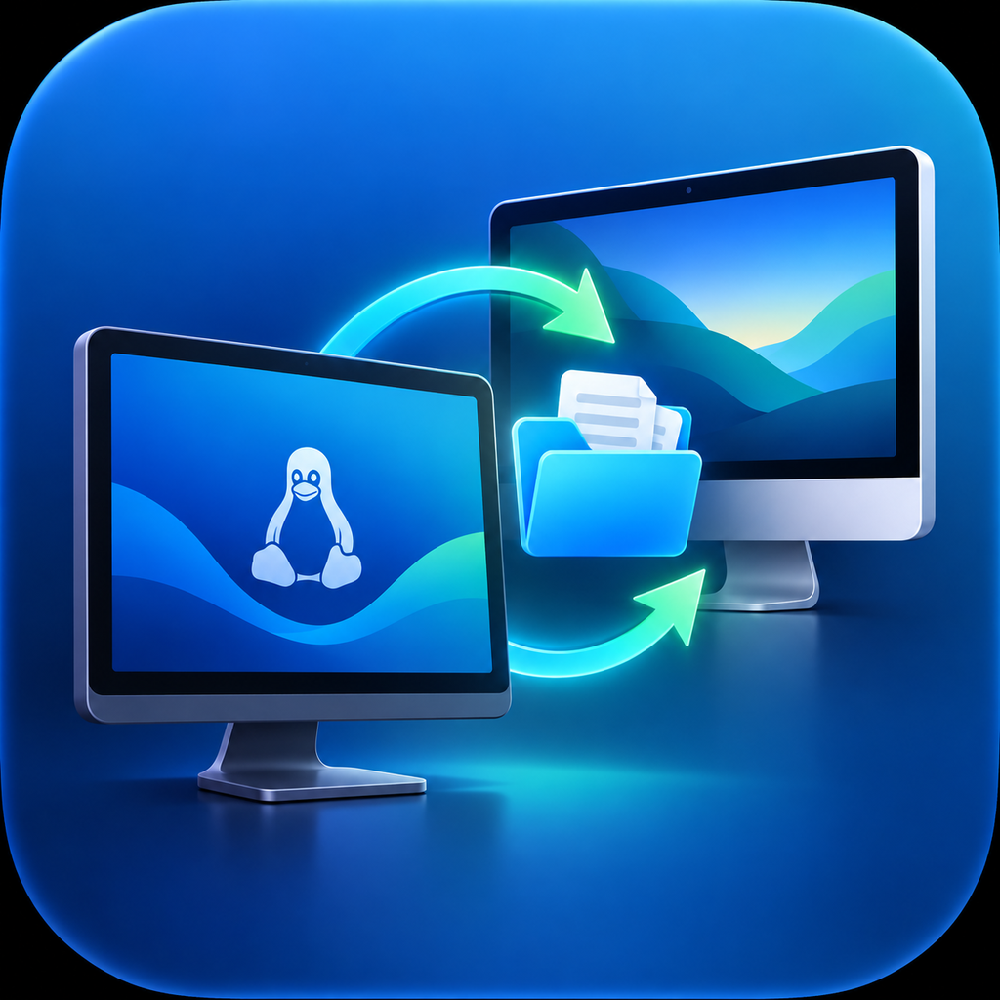
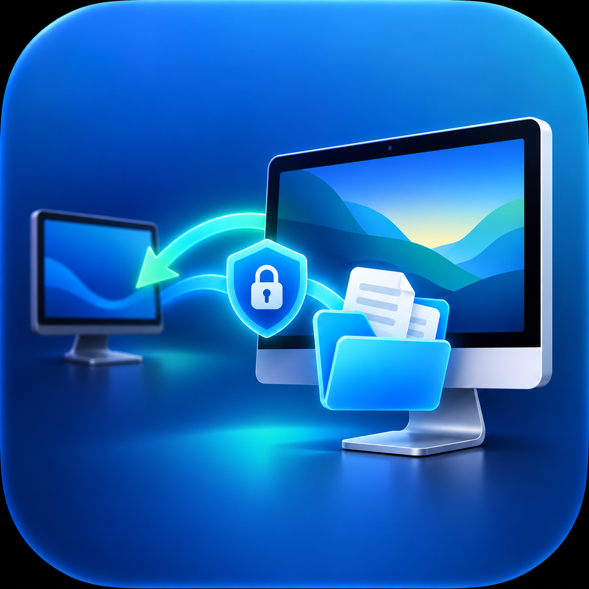

# ZorinMacBridge

<p align="center">
  
  &nbsp;&nbsp;&nbsp;&nbsp;
  
</p>

A LAN-first remote desktop bridge for a **Zorin OS / Linux workstation → macOS development machine** workflow.

The intended setup is simple: keep Linux as the main machine for web/app development, and use the Mac only for Xcode, iOS Simulator, signing, builds, or other Apple-only tooling.

The remote session does **not** require a vendor cloud, relay, account, telemetry service, or Internet connection. Optional LAN discovery uses local mDNS/Bonjour only. GitHub is contacted only when you explicitly install/update the app or manually select **Check for updates**.

> **Status:** experimental. This project is still under active development and has not received an independent security audit.

## Native Zorin/GNOME client UI

v0.5 moves the Linux client to **GTK4 + libadwaita**. On Zorin OS / Ubuntu, controls, spacing, dialogs, switches and file browsing now use the desktop's native GTK/libadwaita theme instead of the old raw Tkinter interface.

The `.deb` declares the required Ubuntu/Zorin runtime packages, so the one-command installer still handles everything through `apt`. The client uses system symbolic icons and native file dialogs.


## Install

### Zorin OS / Ubuntu — Client

Copy and paste one command:

```bash
curl -fsSL https://raw.githubusercontent.com/ILoveMyProjects/ZorinMacBridge/master/install-linux.sh | bash
```

The installer downloads the latest `.deb`, verifies its published SHA-256 checksum, installs it with `apt`, and adds **ZorinMacBridge Client** to the application menu.

### macOS — Server

> The Apple computer runs **macOS**. iOS is the target platform you build for in Xcode.

Copy and paste one command on the Mac:

```bash
curl -fsSL https://raw.githubusercontent.com/ILoveMyProjects/ZorinMacBridge/master/install-macos.sh | bash
```

The installer detects Apple Silicon vs Intel, downloads the correct `.dmg`, verifies SHA-256, and installs **ZorinMacBridge Server** into `/Applications`.

Starting with v0.6, installation uses a **persistent per-Mac local code identity**. No GitHub signing secret, Linux certificate setup, or Developer ID is required for this private/internal workflow. The Mac creates the identity automatically and reuses it for future updates.

## Remote desktop architecture

The old prototype captured individual JPEG screenshots and sent them on the same connection used for mouse and keyboard input. That design could eventually fill the TLS socket buffer and block/disconnect the whole remote session.

v0.4 changes the architecture:

```text
Linux client                         macOS server

control TLS socket   ──────────────► mouse / keyboard / clipboard
video TLS socket     ◄────────────── H.264 stream
file TLS sockets     ◄─────────────► files / folders
```

The video path uses:

- **ScreenCaptureKit** for continuous macOS display capture **inside the main server process**;
- **VideoToolbox** for real-time H.264 encoding on the Mac;
- **PyAV/FFmpeg** for H.264 decoding on Linux;
- a dedicated TLS video connection so slow video rendering cannot block mouse/keyboard traffic.

A completely static macOS desktop can legitimately produce no new ScreenCaptureKit/H.264 data for a while. The Linux client therefore treats video socket read timeouts as idle intervals rather than disconnects. TCP keepalive and the control channel are used to detect real peer loss.

The Linux client exposes four per-connection quality presets:

| Quality | Max width | FPS | Target bitrate |
|---|---:|---:|---:|
| Low | 1280 px | 15 | 3 Mbit/s |
| Balanced | 1920 px | 30 | 8 Mbit/s |
| High | 2560 px | 30 | 14 Mbit/s |
| Ultra | 3840 px | 60 | 25 Mbit/s |

The Mac never upscales the captured display; these are upper bounds. The server clamps client requests to sane limits before starting VideoToolbox.

## Normal setup

### First setup on the Mac

1. Install **ZorinMacBridge Server**.
2. Open it locally once.
3. In the macOS server window, use **Request Screen Recording Access** if the status says *Not granted*, then approve **ZorinMacBridge Server** in macOS. v0.4.3+ keeps capture inside that same app process.
4. Use **Request Mouse/Keyboard Access** if input control is not granted. The app requests permission for synthetic Core Graphics events and opens the relevant macOS privacy pane when needed.
5. Enter a session password of at least 12 characters.
6. Keep **Remember password verifier on this Mac** enabled.
7. Click **Start server**.

The Mac stores only a salted PBKDF2 password verifier; it does not store the plaintext session password.

### First connection from Zorin/Linux

1. Open **ZorinMacBridge Client**.
2. Select the discovered Mac.
3. Verify/paste the Mac TLS SHA-256 fingerprint once.
4. Enter the session password.
5. Keep **Remember this Mac** enabled.
6. Connect.

After a successful connection, the client stores:

- the trusted TLS fingerprint in its local config;
- the session password in the Linux desktop system keyring when available;
- the Mac's persistent random server ID, so credentials are associated with the machine rather than only its current IP address.

On later connections, discovery can restore the saved fingerprint/password automatically.

## Mac mini / unattended user session

By default ZorinMacBridge remains manual.

For a Mac mini that you do not want to walk over to every time, enable these two options in the server window:

- **Launch ZorinMacBridge Server when this macOS user logs in**
- **Automatically start the server when the app launches**

This creates a **per-user LaunchAgent/login item**, not a system daemon. It only runs inside a logged-in macOS user session.

That distinction matters: screen capture and GUI input control operate on a user desktop session. If the Mac reboots and nobody logs in, there is no normal desktop session for ZorinMacBridge to control. If you require access immediately after reboot, configure the Mac so the intended desktop user session becomes logged in, then let ZorinMacBridge start in that session.

Closing ZorinMacBridge still stops the server. Disabling **Launch at login** removes the user LaunchAgent.

## Stable macOS permissions

macOS controls Screen Recording and mouse/keyboard control through its privacy/TCC system. ZorinMacBridge cannot silently grant itself those permissions. In v0.5.2+, the server window has explicit **Request Screen Recording Access** and **Request Mouse/Keyboard Access** buttons. Those APIs are invoked only by a local click on the Mac; a remote connection never triggers a privacy prompt.

For permissions to survive application updates reliably, macOS needs to recognize the new build as the same application. Ad-hoc signed builds do not provide a stable code identity across changed versions. For private/internal use, ZorinMacBridge now supports a persistent self-signed code-signing identity generated entirely on Zorin/Linux. The project keeps the bundle identifier stable as:

```text
com.ilovemyprojects.zorinmacbridge.server
```

For a true VNC/remote-desktop product, Apple also documents the restricted **Persistent Content Capture** entitlement:

```text
com.apple.developer.persistent-content-capture
```

Apple requires explicit approval before an app can use that entitlement. Do not add it to release signing until Apple has approved the entitlement for the developer account.

Until releases use a stable signing identity, macOS may treat a newly downloaded build as a different executable and ask for privacy approval again even when a similarly named entry is already enabled in System Settings.

## Remote controls

- continuous H.264 macOS screen stream;
- explicit **Capture keyboard & mouse** switch in the Linux client;
- mouse movement, left/right/middle click, drag and drop when input capture is enabled;
- scrolling and keyboard input when input capture is enabled;
- Linux-friendly shortcut mapping;
- bidirectional text clipboard;
- file and complete-folder transfer;
- client-selectable H.264 quality presets;
- optional automatic reconnect after unexpected LAN/session drops.

The client starts in **view-only mode**. Enable **Capture keyboard & mouse** when you want local input to control the Mac. Turning it off immediately releases any keys/modifiers/buttons the client believes are held down.

### Full-screen remote desktop

- **Double-click** the remote desktop image to enter full-screen mode.
- While full-screen, a top status bar shows connection state, selected video quality, input-capture state, and the exit instructions.
- Leave full-screen with **Alt+Esc**, the **Exit Full Screen** button, or by **double-clicking the top status bar**.
- Double-clicking the remote image while already full-screen is sent to the Mac instead of exiting, so normal remote double-click actions remain usable.
- **Alt+Esc is reserved locally** while full-screen is active and is not sent to the Mac.
- Entering or leaving full-screen releases held remote input state to avoid a stuck Alt/Ctrl/Command key.

### Video quality and reconnect

Use **Video quality** in the connection card to choose Low, Balanced, High, or Ultra. The selected profile applies to the next video connection/reconnection.

**Auto reconnect** is enabled by default. If the control session ends unexpectedly, the client retries with bounded backoff. Choosing **Disconnect** manually cancels pending reconnect attempts.

### Keyboard mapping

| Linux keyboard | Remote macOS |
|---|---|
| Left `Ctrl` | `Command (⌘)` |
| Right `Ctrl` | real macOS `Control` |
| `Ctrl+C` | `⌘C` |
| `Ctrl+V` | `⌘V` |
| `Ctrl+A` | `⌘A` |
| `Ctrl+S` | `⌘S` |
| `Ctrl+Z` | `⌘Z` |
| `Ctrl+F` | `⌘F` |

Use **Right Ctrl+C** when you need real macOS `Control+C`, for example to interrupt a process in Terminal.

## Clipboard

Text clipboard synchronization is built in:

- `Ctrl+V` pushes the Linux clipboard to macOS before sending `⌘V`;
- after copy/cut, the client can pull the macOS text clipboard back to Linux;
- explicit **Clipboard Linux → Mac** and **Clipboard Mac → Linux** buttons are available.

Clipboard synchronization is currently text-only.

## Shared files and folders

The Linux **Files** page is now a native GTK/libadwaita-style browser with system folder/file icons, the current remote path, upload/download actions, parent navigation, refresh, and native Zorin/GNOME file/folder pickers.

The default macOS share is:

```text
~/ZorinMac-Share
```

From Linux you can:

- browse the remote directory tree;
- create folders;
- upload one or many files;
- upload a complete directory tree;
- download individual files;
- download complete directory trees.

Remote file access is restricted to the configured share root. Symlinks are skipped.

On the Mac server, click **Open Shared Folder** (or press **Command+Shift+O**) to open the configured share directly in Finder. The default is `~/ZorinMac-Share`.

File transfer is explicit rather than automatic two-way source synchronization. This avoids silently overwriting newer project files when both machines have changed the same path.

## LAN auto-discovery

While the server is running, it can advertise:

```text
_zorinmacbridge._tcp.local.
```

The advertisement contains basic LAN connection metadata and a persistent random server ID. It does **not** publish the session password, TLS private key, clipboard contents, or shared files.

Discovery does not automatically create trust. On first pairing, verify the TLS fingerprint shown by the Mac. After that successful pairing, the Linux client can remember the trusted fingerprint locally.

## Updates

There is **no background update check**.

Choose **Help → Check for updates** manually. The app then:

1. checks GitHub Releases;
2. downloads the correct package and checksum after your approval;
3. verifies SHA-256;
4. asks the operating system for administrator authorization;
5. installs the update;
6. offers to restart the application.

On Linux, **Restart now** immediately replaces the current process with `/usr/bin/zorinmacbridge` after the verified package is installed. It deliberately does not wait for GTK, the tray backend, or network-worker cleanup first, preventing blocking teardown from leaving the old window in a “not responding” state.

You can also re-run the one-command installer.


## Stable macOS permissions across updates

There is **no signing setup to run on Zorin/Linux**. Do not create GitHub signing secrets and do not run a signing helper.

For v0.6+, each Mac automatically owns one persistent local signing identity. The one-command installer and the in-app updater re-sign the staged server app with that same identity before placing it in `/Applications`. The private key never leaves the Mac.

The first migration from an older v0.5.x build can require Screen Recording and mouse/keyboard approval once because the code identity genuinely changes at that boundary. After migration, normal v0.6+ updates reuse the same identity on that Mac.

See [`SIGNING.md`](SIGNING.md) for the architecture.

## Security model

- LAN/private-address connections only;
- TLS 1.2+;
- pinned SHA-256 server certificate fingerprint;
- password authentication after TLS verification;
- separate video/control/file channels;
- no cloud relay;
- no vendor account;
- no telemetry;
- no UPnP/router configuration;
- file access constrained to the configured share directory;
- plaintext server password is not stored on the Mac;
- remembered Linux passwords use the desktop system keyring when available.

See [SECURITY.md](SECURITY.md).

## Releases

Manual downloads:

- [Linux amd64 `.deb`](https://github.com/ILoveMyProjects/ZorinMacBridge/releases/latest/download/ZorinMacBridge-Client_linux-amd64.deb)
- [macOS Apple Silicon `.dmg`](https://github.com/ILoveMyProjects/ZorinMacBridge/releases/latest/download/ZorinMacBridge-Server_macOS-arm64.dmg)
- [macOS Intel `.dmg`](https://github.com/ILoveMyProjects/ZorinMacBridge/releases/latest/download/ZorinMacBridge-Server_macOS-x86_64.dmg)

---

# Build / run from source

Normal users should use the installers above.

## Linux client

The source client uses the native Zorin/Ubuntu GTK stack. The setup script installs the required system packages, then `run_client.sh` launches the GTK4/libadwaita client.

```bash
git clone https://github.com/ILoveMyProjects/ZorinMacBridge.git
cd ZorinMacBridge
chmod +x scripts/setup-source-linux.sh run_client.sh
./scripts/setup-source-linux.sh
./run_client.sh
```

## macOS server

macOS 13+ and Xcode Command Line Tools are required for the native in-process ScreenCaptureKit/VideoToolbox streaming library.

```bash
git clone https://github.com/ILoveMyProjects/ZorinMacBridge.git
cd ZorinMacBridge
chmod +x scripts/setup-source-macos.sh scripts/build-macos-streamer.sh
./scripts/setup-source-macos.sh
./.venv/bin/python mac_server_gui.py
```

## Tests

```bash
python test_protocol.py
python test_support.py
python test_updater.py
python test_native_ui.py
python test_local_signing.py
python -m compileall -q .
swiftc -frontend -parse native/macos/ZMBStreamerLib.swift
```

The final macOS compilation of the native streaming dylib is performed on the macOS GitHub Actions runners because ScreenCaptureKit and VideoToolbox are macOS frameworks. The dylib is loaded into `ZorinMacBridge Server.app` with `ctypes`; it is not launched as a child capture process.

## Troubleshooting

The Linux client includes a **Logs** tab. Connection logs show TCP, TLS, fingerprint verification, authentication, control-channel state, H.264 video-channel state, decode errors, and disconnect reasons. Passwords are never written to the logs.

If macOS asks for Screen Recording **when you press Connect**, make sure you are on v0.4.3 or newer. v0.4.0-v0.4.2 launched a separate native capture executable, which could be treated as separate TCC-responsible code. v0.4.3 runs ScreenCaptureKit in the main server process instead.

v0.6+ re-signs installed updates with the same persistent local identity on each Mac. If permissions change after a normal v0.6+ update, treat that as a bug and capture the server log plus the `Code signing:` line from the server UI.

If video works but mouse/keyboard does not, check the Mac server log for:

```text
Accessibility permission: granted
```

If it says Accessibility is not granted, enable **ZorinMacBridge Server** under **System Settings → Privacy & Security → Accessibility**, then quit and reopen the application.

## License

MIT — see [LICENSE](LICENSE).

## macOS privacy permissions and updates

Screen Recording and Accessibility are macOS TCC permissions tied to the app's code identity.
The release artifact's transport identity is not the installed identity in v0.6+: the staged app is re-signed locally before installation.
ZorinMacBridge never bypasses TCC and, starting with v0.5.1, a remote **Connect** will not
trigger the Screen Recording prompt: if permission is missing, the video channel fails with
a clear message and the permission must be granted locally on the Mac.

Stable permissions across v0.6+ updates use the automatic per-Mac identity described in [`SIGNING.md`](SIGNING.md); no Linux signing command is required.

### macOS privacy permissions across updates

macOS installs from **v0.6 onward use a persistent per-Mac code identity**.
The release workflow produces a signed transport artifact; the installer/updater applies that Mac's persistent local identity before installation.
After the one-time migration from an older build, Screen Recording and mouse/keyboard privacy grants are intended to remain associated with the same installed app identity across normal v0.6+ updates.
See `SIGNING.md`.
